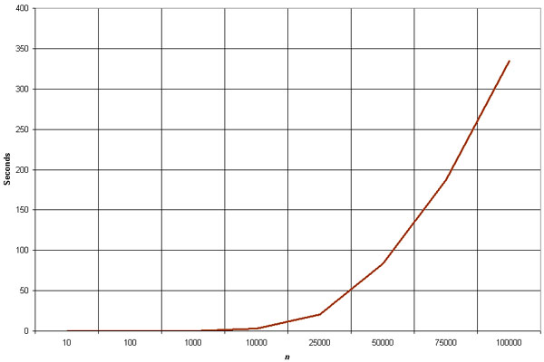
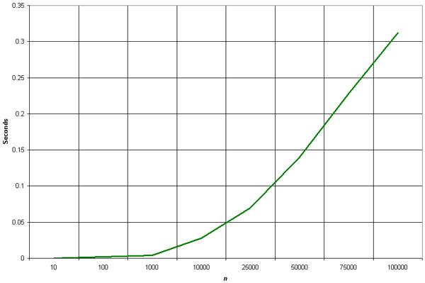

# Verantwoordingsdocument

## Studentgegevens

- Naam: Remco (G.H.) Volkers
- Studentcode: 460318

Ik zal per rubriek een locatie geven waar de code te vinden is, een toelichting geven die context bevat. Vervolgens een
beschrijving van de functionaliteit en daarna de testcases zoals ik deze gewend ben van werk.

## Rubriek 1: Complexiteit en efficiëntie

- **Locatie in de code:** [Zoeken in Datastructuren implementatie](/src/commands/SearchCommand.java)
  en [Sorteren in Datastructuren implementatie](/src/commands/SortCommand.java)
- **External sources:**
  [geekforgeeks insertion sort](https://www.geeksforgeeks.org/insertion-sort/) /
  [geekforgeeks quick sort](https://www.geeksforgeeks.org/quick-sort/)
- **Toelichting:**
  De [zoekcommando](src/commands/SearchCommand.java) is het startpunt voor everything 'zoeken' uit de applicatie en
  fungeert als submenu voor de zoekfunctionaliteit van de applicatie. De gebruiker navigeert naar het menu door in het
  hoofdmenu 'zoeken' te selecteren en kan vanuit daar door
  naar de specifieke commando's, aangeraden is om deze separation of concerns aan te houden voor toekomstige
  datastructuren en/of zoekalgoritmen. Het [sortcommando](src/commands/SortCommand.java) is de uitgangspositie om de
  sort functionaliteit aan te spreken.
- Zoeken is momenteel mogelijk voor de volgende
  datastructuren:
    - [(custom) Hashmap](src/datastructures/RemcoHashMap.java) → Get functie, op basis van een sleutel krijg je de
      waarde
      of null bij geen match
      terug uit de collectie
    - [(custom) Binary Search Tree](src/datastructures/RemcoBST.java) → [Custom Hashmap](src/datastructures/RemcoHashMap.java)
      zie method `get` startend op regel 56.
    - [(custom) LinkedList](src/datastructures/RemcoList.java) → [Lineair Zoeken](src/searchalgorithms/LinearSearch.java)
    - Java List<Station> → [Binair Zoeken](src/searchalgorithms/BinarySearch.java)
- **Beschrijving van de functionaliteit:**
  Op basis van een ingegeven stationscode van de gebruiker wordt het gevonden station teruggegeven.

    - **Sorteer algoritmen:**
        - **Insertionsort:** Implementatie in [InsertionSort](src/sortalgorithms/InsertionSort.java). Sorteert een
          lijst
          door elk element te vergelijken met de voorgaande elementen en het op de juiste positie in te voegen.
        - **Quicksort:** Implementatie in [QuickSort](src/sortalgorithms/QuickSort.java). Dit is een efficiënt
          sorteeralgoritme dat gebruik maakt van een divide-and-conquer strategie om elementen rond een 'pivot' te
          ordenen.

### **Testen:**

- **Locatie in de Code:** [BinarySearchTest](test/searchalgorithms/BinarySearchTest.java)

1. **Test zoeken van bekend element:**
    - **Doel:** Controleert of de `binarySearch` methode het correcte `Station` object kan vinden wanneer de sleutel
      (stationscode) aanwezig is in de lijst.
    - **Testmethode:** `testZoekenMetResultaat()`
    - **Resultaat:** De methode zou een `Station` object moeten retourneren met de stationscode '002', wat aantoont dat
      het zoekalgoritme correct werkt voor bestaande sleutels.

2. **Test zoeken van onbekend element:**
    - **Doel:** Controleert of de `binarySearch` methode correct aangeeft dat een sleutel niet aanwezig is in de lijst.
    - **Testmethode:** `testZoekenZonderResultaat()`
    - **Resultaat:** De methode zou `null` moeten retourneren voor de sleutel '004', wat aangeeft dat het algoritme
      correct identificeert wanneer een sleutel niet bestaat in de lijst.

3. **Test zoeken in lege lijst:**
    - **Doel:** Test het gedrag van de `binarySearch` methode wanneer deze wordt uitgevoerd op een lege lijst.
    - **Testmethode:** `testZoekenLegelijst()`
    - **Resultaat:** De methode zou `null` moeten retourneren, wat aangeeft dat het algoritme correct handelt in het
      geval van een lege lijst.

4. **Test zoeken op uitersten:**
    - **Doel:** Verifieert of de `binarySearch` methode correct functioneert bij het zoeken naar elementen aan de
      uiteinden van de lijst.
    - **Testmethode:** `testZoekenUitersten()`
    - **Resultaat:** De methode zou de correcte `Station` objecten moeten vinden voor zowel het eerste als het laatste
      element in de lijst (stationscodes '001' en '003'), wat aantoont dat het algoritme correct functioneert bij
      randgevallen.

- **Locatie in de Code:** [LinearSearchTest](test/searchalgorithms/LinearSearchTest.java)

1. **Test zoeken van bestaand element:**
    - **Doel:** Controleert of de `linearSearch` methode het correcte `Station` object kan vinden wanneer de sleutel
      (stationscode) aanwezig is in de lijst.
    - **Testmethode:** `testZoekenMetResultaat()`
    - **Resultaat:** De methode zou een `Station` object moeten retourneren met de stationscode '002', wat aantoont dat
      het lineair zoekalgoritme correct werkt voor bestaande sleutels.

2. **Test zoeken van onbekend element:**
    - **Doel:** Controleert of de `linearSearch` methode correct aangeeft dat een sleutel niet aanwezig is in de lijst.
    - **Testmethode:** `testZoekenZonderResultaat()`
    - **Resultaat:** De methode zou `null` moeten retourneren voor de sleutel '004', wat aangeeft dat het algoritme
      correct identificeert wanneer een sleutel niet bestaat in de lijst.

3. **Test zoeken in empty list:**
    - **Doel:** Test het gedrag van de `linearSearch` methode wanneer deze wordt uitgevoerd op een lege lijst.
    - **Testmethode:** `testZoekenLegelijst()`
    - **Resultaat:** De methode zou `null` moeten retourneren, wat aangeeft dat het algoritme correct handelt in het
      geval van een lege lijst.

4. **Test zoeken op uitersten:**
    - **Doel:** Verifieert of de `linearSearch` methode correct functioneert bij het zoeken naar elementen aan de
      uiteinden van de lijst.
    - **Testmethode:** `testZoekenUitersten()`
    - **Resultaat:** De methode zou de correcte `Station` objecten moeten vinden voor zowel het eerste als het laatste
      element in de lijst (stationscodes '001' en '003'), wat aantoont dat het algoritme correct functioneert bij
      randgevallen.

#### Testen voor sorteer-algoritmen

1. **Insertionsort test:**
    - **Testmethode:** `testInsertionSort()` in [InsertionSortTest](test/sortalgorithms/InsertionSortTest.java)
    - **Doel:** Checked of de `insertionSort` methode een lijst van `Station` objecten correct sorteert.
    - **Resultaat:** De test controleert dat de lijst correct gesorteerd is na het aanroepen van de `insertionSort`
      methode, wat aantoont dat het algoritme effectief is.

2. **Quicksort Test:**
    - **Testmethode:** `testQuickSort()` in [QuickSortTest](test/sortalgorithms/QuickSortTest.java)
    - **Doel:** Controleert of de `quickSort` methode een lijst van `Station` objecten correct en efficiënt sorteert.
    - **Resultaat:** De test bevestigt dat de lijst correct gesorteerd is na het aanroepen van de `quickSort` methode,
      wat de effectiviteit en efficiëntie van het algoritme aangeeft.

#### Big-O grafieken van sorteeralgoritmen

**Insertion sort**

- **Best case scenario:** O(n)
    - Wanneer de lijst al gesorteerd is. Elk element hoeft alleen vergeleken te worden met zijn voorganger.
- **Average case scenario:** O(n²)
    - Bij willekeurige volgorde van elementen, wat resulteert in veel vergelijkingen en verschuivingen.
- **Worst case scenario:** O(n²)
    - Wanneer de lijst in omgekeerde volgorde gesorteerd is, met maximale vergelijkingen en verschuivingen.

**Quicksort**

- **Best case scenario:** O(n log n)
    - Dit scenario treedt op wanneer de 'pivot' bij elke stap van de recursie de lijst effectief in tweeën verdeelt.
- **Average case scenario:** O(n log n)
    - In de meeste gevallen, zelfs met willekeurige data, zal Quick Sort de lijst efficiënt sorteren door de lijst bij
      elke stap in ongelijke, maar nog steeds beheersbare delen te verdelen (divide and conquer).
- **Worst case scenario:** O(n²)
    - Dit gebeurt wanneer het kleinste of grootste element als pivot wordt gekozen bij elke stap.

Hieronder zijn de grafieken die de tijdcomplexiteit van Insertion Sort en Quick Sort illustreren en daarna een
vergelijking maken tussen binary search en linear search:
[source](http://clweb.csa.iisc.ac.in/pradeep/Output/Sorting%20Algorithms.htm)
[source](https://www.curioustem.org/stem-articles/linear-search-vs-binary-search)

*Grafiek van de tijdcomplexiteit van insertion-sort.*

*Grafiek van de tijdcomplexiteit van quick-sort.*

#### Big-O complexiteit van zoekalgoritmen

1. **Linear-search:**
    - **Complexiteit:** O(n) - Het algoritme doorloopt elk element in RemcoList tot het de gezochte waarde vindt of het
      einde van de lijst bereikt. De tijd neemt lineair toe met het aantal elementen in de lijst.

2. **Binary-search:**
    - **Complexiteit:** O(log n) - Het algoritme halveert de zoekruimte bij elke stap. Het gebruikt de mid-point
      berekening en vergelijkt vervolgens om te beslissen welk deel van de lijst verder moet worden doorzocht.

## Rubriek 2: LinkedList

- **Locatie in de code:** [RemcoList](src/datastructures/RemcoList.java)
- **Toelichting en Onderbouwing:**
  RemcoList heb ik alleen gemaakt voor de opdracht. Ik heb ervoor gezorgd dat het de juiste functies omvat voor een
  linked list en heb hem gebruikt om een stations2 te vullen in [ApplicationData](src/core/ApplicationData.java) → zie
  method `init` startend op regel 20, [Dataloader -> Load To RemcoList](src/utils/DataLoader.java) bij
  method `LoadToRemcoList`(startend op regel 36) en het lineaire zoekalgoritme.
- **Beschrijving van de Functionaliteit:**
  RemcoList is een standaard implementatie van een linked list. Elk node element wijst naar de volgende node. Om
  door de gehele lijst te itereren, begint men bij de eerste node en volgt de keten van nodes. De lijst is generiek
  geïmplementeerd, waardoor deze met verschillende datatypes kan werken.

#### **Testen:**

- **Locatie in de code:** [RemcoList test](test/datastructures/RemcoListTest.java)

De RemcoList wordt in de test gevuld door [mockstations.csv](test/resources/mockstations.csv)

1. **Test lege RemcoList (`testIsLeeg`):**
    - Controleert of de `isEmpty` methode correct aangeeft of de lijst leeg is.
    - Verwacht resultaat: `false` voor een niet-lege lijst en `true` voor een lege lijst.

2. **Test grootte van RemcoList (`testSize`):**
    - Test of de `size` methode correct het aantal elementen in de lijst retourneert.
    - Verwacht resultaat: 3 voor de initiële lijst.

3. **Test toevoegen van element (`testAdd`):**
    - Controleert of een nieuw element correct aan de lijst wordt toegevoegd.
    - Verwacht resultaat: Size van de lijst is 4 na het toevoegen van een nieuw station.

4. **Test element bestaat (`testContains`):**
    - Controleert of de `contains` methode correct bepaalt of een specifiek element in de lijst aanwezig is.
    - Verwacht resultaat: `true` voor een element dat in de lijst zit.

5. **Test verwijderen van element (`testRemove`):**
    - Test of een element correct uit de lijst wordt verwijderd.
    - Verwacht resultaat: Size van de lijst is 2 en `contains` retourneert `false` voor het verwijderde element.

6. **Test getten van element (`testGet`):**
    - Controleert of de `get` methode het juiste element op basis van een gegeven waarde terug geeft.
    - Verwacht resultaat: Het opgehaalde station heeft de code '002'.

## Rubriek 3: Hash Table / HashMap

- **Locatie in de Code:** [RemcoHashmap](src/datastructures/RemcoHashMap.java)
- **External Sources:**
  [Baeldung Java HashMap Advanced](https://www.baeldung.com/java-hashmap-advanced) /
  [Turing Java Hashmap Implementation](https://www.turing.com/kb/implementing-hashmap-in-java)
- **Toelichting en Onderbouwing:** Hier heb ik ook veel inspiratie opgedaan van de sheets en Java's eigen Hashmap (en
  external sources >>)
- **External sources**:
  [baeldung](https://www.baeldung.com/java-hashmap-advanced) / [turing.com](https://www.turing.com/kb/implementing-hashmap-in-java)
- **Beschrijving van de Functionaliteit:** De RemcoHashmap functioneert 'gewoon' als een java hashmap zoals ik hem ken.
  Je kan Key-Value pairs opslaan in een RemcoHashMap en deze vervolgens aanspreken met de Key. Je kan elementen
  toevoegen met een Key en een Value ook wel Buckets genoemd. En heb hierdoor ook een private class
  toegevoegd [HashmapEntry<K, V>](src/datastructures/RemcoHashMap.java) wat een bucket voorstelt. Dat zijn de elementen
  die je vindt in een RemcoHashMap.

#### **Testen:**

- **Locatie in de Code:** [RemcoHashmap test](test/datastructures/RemcoHashMapTest.java)

De RemcoHashmap wordt in de test gevuld door [mockstations.csv](test/resources/mockstations.csv)

1. **Test put en get (`testPutEnGet`):**
    - Controleert of waarden correct worden opgeslagen en opgehaald via de `put` en `get` methoden.
    - Verwacht resultaat: De correcte stationsnamen worden geretourneerd voor elke sleutel.

2. **Test size van de RemcoHashmap (`testSize`):**
    - Test of de `size` methode correct het aantal key-value pairs in de map retourneert.
    - Verwacht resultaat: 3, gezien er drie key-value pairs zijn toegevoegd aan de map.

3. **Test collisions (`testCollisions`):**
    - Controleert hoe RemcoHashmap collisions afhandelt
    - Verwacht resultaat: De hashmap slaagt erin om beide stations met unieke keys correct op te slaan en op te
      halen, ondanks dezelfde hashcode.

4. **Test replace value (`testVervangValue`):**
    - Test of het vervangen van een value door een bestaande key correct werkt met de `put` methode.
    - Verwacht resultaat: De nieuwe waarde voor key "001" wordt correct opgeslagen en opgehaald, terwijl de size
      van de map ongewijzigd blijft.

## Rubriek 4: Binary Tree

- **Locatie in de code:** [RemcoBST](src/datastructures/RemcoBST.java)
- **External sources:** [BaelDung Java BST](https://www.baeldung.com/java-binary-tree)
- **Toelichting en onderbouwing:**
    - De `RemcoBST` is een custom implementatie van een Binary Search Tree (BST), specifiek ontworpen voor het efficiënt
      doorzoeken van stations op basis van hun code. De datastructuur staat bekend om de snelle zoekoperaties die het
      biedt, vooral nuttig in datasets met een grote hoeveelheid gegevens.

- **Beschrijving van de functionaliteit:**
    - De `RemcoBST` slaat `Station` objecten op in een boomstructuur. Stations worden toegevoegd op een zodanige manier
      dat voor elke knoop, alle links gelegen knopen een lagere code hebben en alle rechts gelegen knopen een hogere
      code. Dit zorgt voor efficiënt zoeken, toevoegen en verwijderen van stations.
    - De `vindMetCode` methode maakt gebruik van de eigenschappen van de BST om snel een station te vinden op basis van
      zijn code. Als de code niet gevonden wordt, retourneert de methode `null`.
    - De datastructuur heeft ook een toGraphViz optie. Deze slaat vervolgens een gegenereerde svg op in
      de [assets](src/assets) folder → nadat de gebruiker deze functionaliteit heeft gecalled vanuit de console
      applicatie.

#### **Testen van RemcoBST:**

- **Locatie in de code:** [RemcoBSTTest](test/datastructures/RemcoBSTTest.java)

1. **Test vinden op basis van code (`testVindMetCode`):**
    - Test of de `vindMetCode` methode correct een station vindt gegeven een specifieke code.
    - Verwacht resultaat: Vindt en retourneert het `Station A` object voor de code "001".

2. **Test niet gevonden op basis van code (`testVindNietMetCode`):**
    - Test het scenario waar de gezochte code niet aanwezig is in de BST.
    - Verwacht resultaat: Retourneert `null` voor niet-bestaande code "999".

## Rubriek 5: Heap

- **Locatie in de code:** [RemcoMinHeap](src/datastructures/RemcoMinHeap.java)
- **External sources:**
  [geeksforgeeks Min Heap in Java](https://www.geeksforgeeks.org/min-heap-in-java/) /
  [github min heap implementation](https://gist.github.com/flexelem/70b120ac9bf2965f419f) →
  [github contributor](https://gist.github.com/flexelem)
- **Toelichting en onderbouwing:**
    - De `RemcoMinHeap` is een implementatie van een min-heap, een gespecialiseerde boomstructuur waarbij de waarde van
      elke ouderknoop kleiner is dan of gelijk aan die van zijn kindknopen. Dit zorgt voor efficiënte toegang tot het
      kleinste element.
- **Beschrijving van de functionaliteit:**
    - De min-heap ondersteunt de basisoperaties `add` voor het toevoegen van elementen, `pop` voor het verwijderen van
      het kleinste element en `peek` voor het bekijken van het kleinste element zonder het te verwijderen. De interne
      structuur zorgt ervoor dat de kleinste waarde altijd aan de wortel van de heap staat, waardoor toegang tot deze
      waarde in constante tijd mogelijk is.

### Testen van RemcoMinHeap

- **Locatie in de code:** [RemcoMinHeapTest](test/datastructures/RemcoMinHeapTest.java)

1. **Test toevoegen (`testAdd`):**
    - Test of nieuwe elementen correct aan de heap worden toegevoegd.
    - Verwacht resultaat: Na toevoeging van meerdere elementen, moet `peek` het kleinste element (1) retourneren.

2. **Test verwijderen (`testRemove`):**
    - Test of het `pop`-mechanisme de kleinste elementen correct verwijdert en de heap opnieuw ordent.
    - Verwacht resultaat: Na verwijdering van het kleinste element (1), moet het volgende kleinste element (2) aan de
      top van de heap staan.

3. **Test lege heap (`testIsEmpty`):**
    - Controleert of de `isEmpty` methode correct de lege staat van de heap bepaalt.
    - Verwacht resultaat: True voor een lege heap en false na het toevoegen van een element.

4. **Test verwijderen uit lege haep (`testRemoveFromEmptyHeap`):**
    - Controleert of het verwijderen van een element uit een lege heap een correcte exception throwed.
    - Verwacht resultaat: Het aanroepen van `pop` op een lege heap throwed een `IllegalStateException`.

## Rubriek 6: Graph

- **Locatie in de code:** [Graph](src/datastructures/Graph.java)
- **Toelichting en onderbouwing:**
    - De `Graph` class is het kernonderdeel van de applicatie en dient als de basis voor het spoorwegnetwerk. De graaf
      biedt flexibiliteit en efficiëntie die passend is voor het representeren van complexe netwerken zoals spoorwegen.
- **Beschrijving van de functionaliteit:**
    - De `Graph` class slaat stations en hun verbindingen (tracks) op. Elk station wordt gerepresenteerd als een
      knooppunt, en elke verbinding als een rand in de graaf. De class biedt functionaliteit om stations en verbindingen
      toe te voegen, en biedt ook methodes om stations en verbindingen op te halen.
    - De `toGraphViz` methode genereert een representatie van de graaf in GraphViz formaat zodat de gebruiker een
      visuele representatie kan opvragen van de graaf. → Deze slaat vervolgens een gegenereerde svg op in
      de [assets](src/assets) folder → nadat de gebruiker deze functionaliteit heeft gecalled vanuit de console
      applicatie.

### Testen van de graph

- **Locatie in de code:** [GraphTest](test/datastructures/GraphTest.java)

1. **Test toevoegen en ophalen van stations (`testAddAndGetStations`):**
    - Test of stations correct worden toegevoegd en opgehaald uit de graaf.
    - Verwacht resultaat: Checked of de twee toegevoegde stations correct zijn toegevoegd en controleert dit door de
      grootte van de stationscollectie te inspecteren en daarnaast checked het ook of de juiste stations zijn
      toegevoegd.

2. **Test ophalen van alle tracks (`testGetAllTracks`):**
    - Controleert of de methode alle tracks correct ophaalt uit de graaf.
    - Verwacht resultaat: De lijst van tracks is niet leeg en bevat het juiste aantal tracks.

3. **Test GraphViz formaat (`testToGraphVizFormat`):**
    - Verifieert of de `toGraphViz` methode een correcte GraphViz representatie van de graaf genereert.
    - Verwacht resultaat: De GraphViz string bevat de verwachte verbinding tussen stations en controleert of het start
      als een dotString zoals de java-graphViz library verwacht.

4. **Test toString Methode (`testToString`):**
    - Controleert of de `toString` methode een accurate beschrijving van de graaf levert.
    - Verwacht resultaat: De beschrijving bevat het juiste aantal stations en verbindingen.

## Rubriek 7: Dijkstra’s Algoritme

- **Locatie in de code:** [DijkstraAlgorithm](src/advancedalgorithms/DijkstraAlgorithm.java)
- **Toelichting en onderbouwing:**
    - Dijkstra's Algoritme is geïmplementeerd om de kortste paden in het spoorwegnetwerk te vinden. Het is een
      essentieel onderdeel voor het berekenen van efficiënte routes tussen stations.
- **Beschrijving van de functionaliteit:**
    - Het algoritme gebruikt het `Graph` object eerder besproken en een speciale MinHeap (`DijkstraMinHeap`) om de
      kortste afstanden van een startstation naar alle andere stations in de graaf te berekenen. Het houdt de kortste
      afstanden en de vorige stations bij in een map voor verdere routeconstructie.
    - De `DijkstraMinHeap` is niks meer dan een niet-generieke
      oplossing van de `RemcoMinHeap`. Ik had eerst de generieke `RemcoMinHeap` gemaakt. Maar merkte dat ik het mezelf
      lastiger maakte met het implementeren van Dijkstra's Algoritme. Hierdoor heb ik deze datastructuur geïntroduceerd
      om te werken StationDistancePairs.
    - De `execute` methode initialiseert de benodigde structuren en voert het algoritme uit vanaf een gegeven
      startstation.

### Testen van Dijkstra's Algoritme

- **Locatie in de code:** [AdvancedAlgorithmsTest](test/commands/AdvancedAlgorithmsCommandTest.java)
  / [DijkstraMinHeapTest](test/datastructures/DijkstraMinHeapTest.java)

1. **Test print routeplanning met Dijkstra (`testRoutePlanningDijkstra`):**
    - Test of de routeplanning met Dijkstra's algoritme correct werkt.
    - Verwacht resultaat: Een pad wordt correct gevonden tussen de opgegeven stations.

### Testen van DijkstraMinHeap

1. **Test toevoegen en verwijderen (`addEnPopTest`):**
    - Test of elementen correct worden toegevoegd en verwijderd volgens de prioriteitsregels van de heap.
    - Verwacht resultaat: De elementen worden toegevoegd en in de juiste volgorde verwijderd, beginnend met de kleinste
      afstand.

2. **Test afstandsvermindering (`decreaseKeyTest`):**
    - Controleert de functionaliteit van de `decreaseKey` methode, die de afstand voor een station in de heap
      vermindert.
    - Verwacht resultaat: De afstandswaarde van een station wordt succesvol verminderd en de heap wordt correct opnieuw
      geordend.

3. **Test verwijderen uit lege heap (`popLegeHeapTest`):**
    - Test het gedrag van de heap bij het verwijderen uit een lege heap.
    - Verwacht resultaat: Het aanroepen van `pop` op een lege heap gooit een `IllegalStateException`.

4. **Test afstandsvermindering voor onbekend station (`decreaseKeyOnbestaandStationTest`):**
    - Test de `decreaseKey` methode met een station dat niet in de heap aanwezig is.
    - Verwacht resultaat: Geen impact op de heap en de afstanden blijven ongewijzigd.

## Rubriek 8: A* Algoritme

- **Locatie in de code:** [AStarAlgorithm](src/advancedalgorithms/AStarAlgorithm.java)
- **Toelichting en onderbouwing:**
    - A* Algoritme is geïmplementeerd om het meest efficiënte pad tussen twee stations in het spoorwegnetwerk te vinden.
      Het combineert de voordelen van Dijkstra's algoritme met een heuristische functie om de prestaties te
      optimaliseren, vooral in complexe netwerken met veel knooppunten.
- **Beschrijving van de functionaliteit:**
    - Het algoritme gebruikt een prioriteitswachtrij (`PriorityQueue`) en een heuristische functie om de meest
      veelbelovende paden te prioriteren. Het houdt de afstanden bij van het startstation naar alle andere stations,
      en een lijst van stations waarvan elk station is afgeleid. Deze datastructuur wordt gebruikt om het meest
      efficiënte pad tussen stationA en stationB te herleiden.

### Testen van A* Algoritme

- **Locatie in de code:** [AdvancedAlgorithms](test/advancedalgorithms/AStarAlgorithmTest.java) /
  [AdvancedAlgorithmsCommands](test/commands/AdvancedAlgorithmsCommandTest.java)

1. **Test uitvoering van het algoritme (`testAStarAlgorithm`):**
    - Deze test controleert of het algoritme correct het meest efficiënte pad vindt tussen gegeven start- en
      eindstations.
    - Verwacht resultaat: Het pad bestaat uit de stations in de volgorde: startstation → tussenstation(s) → eindstation.
    - Dit bewijst dat het algoritme niet alleen het kortste pad vindt, maar ook correct de route reconstrueert.
2. **Test routeplanning met AStar (`testRoutePlanningAStar`):**
    - Deze test controleert de integratie van het A* algoritme in de routeplanningsfunctie van de applicatie.
    - Verwacht resultaat: Het resultaat is niet null en het pad mag niet leeg zijn, wat aangeeft dat het algoritme
      een geldig pad vindt tussen de opgegeven stations.

## Rubriek 9: MCST Algoritme

- **Locatie in de code:** [PrimAlgorithm](src/advancedalgorithms/PrimAlgorithm.java)
- **Toelichting en onderbouwing:**
    - Prim's Algoritme is geïmplementeerd om de Minimum Cost Spanning Tree (MCST) te berekenen binnen het
      spoorwegnetwerk. Dit algoritme is essentieel voor het vinden van een subset van spoorverbindingen die alle
      stations verbindt met de minimale totale lengte.
- **Beschrijving van de functionaliteit:**
    - Het algoritme begint bij een startstation en voegt iteratief de kortste track toe aan de boom die een nieuw
      station verbindt. Dit proces gaat door totdat alle stations in de boom zijn opgenomen. De uitvoer is een lijst
      van `Track` objecten die de MCST vertegenwoordigen.

### Testen van Prim's algoritme

- **Locatie in de code:** [AdvancedAlgorithmsCommand](test/commands/AdvancedAlgorithmsCommandTest.java)

- **Opmerking over testen:**
    - De functionaliteit van het Prim's Algoritme is indirect getest via de `AdvancedAlgorithmsCommand` class.

1. **Test print stations in rechthoek (`testPrintStationsInRechthoek`):**
    - Deze test controleert of de methode de juiste stations identificeert binnen een gespecificeerde rechthoekige
      regio.
    - Verwacht resultaat: De methode identificeert correct stations binnen de opgegeven regio.

## Rubriek 10: Regular expressions

- **Locatie in de code:** [DataLoader](src/utils/DataLoader.java)
- **Toelichting en onderbouwing:**
    - De `DataLoader` class maakt gebruik van reguliere expressies (regex) om de geldigheid van data in de CSV-bestanden
      te controleren en te verwerken. Dit zorgt voor een efficiënte en betrouwbare manier om grote datasets te parseren
      en te valideren. Data die deze regex
      valideert: [Tracks](src/resources/tracks.csv) & [stations](src/resources/stations.csv).
- **Beschrijving van de functionaliteit:**
    - De class bevat methoden voor het inladen van stations en tracks uit CSV-bestanden. Reguliere expressies worden
      gebruikt om de data te valideren en te splitsen in de juiste velden, waarbij ongeldige of onvolledige regels
      worden overgeslagen. Deze checks zitten erin omdat er ook [mockdata](test/resources/mockstations.csv) bestaat die
      flagged is alszijnde 'valid' of 'invalid' en zijn er ` `'s toegevoegd voor leesbaarheid.

### Testen van dataLoader met reguliere expressies

1. **Test laden van geldige stations (`testValidStationData`):**
    - Verifieert of de methode correct stations laadt en valideert met reguliere expressies.
    - Verwacht resultaat: Stationslijst is niet leeg en bevat correct geparseerde data voor elk station.

2. **Test laden naar RemcoList (`testRemcoListIsNietLeeg` en `testValidRemcoListStationData`):**
    - Test of stations correct worden geladen in een `RemcoList` met behulp van dezelfde reguliere expressies.
    - Verwacht resultaat: De `RemcoList` met stations is niet leeg en bevat de correcte data.

3. **Test laden van tracks (`testValidTrackData`):**
    - Controleert of de methode correct tracks laadt met reguliere expressies, waarbij alleen geldige data wordt
      geaccepteerd.
    - Verwacht resultaat: Tracks lijst is niet leeg en bevat correcte data voor elke track.

4. **Test laden van data met ongeldige regels (`testInvalidStationData` en `testInvalidTrackData`):**
    - Test de robuustheid van de reguliere expressies bij het omgaan met ongeldige of onvolledige data in de
      CSV-bestanden.
    - Verwacht resultaat: Onjuiste data wordt correct geïdentificeerd en overgeslagen, resulterend in correct aantal
      geladen objecten.

